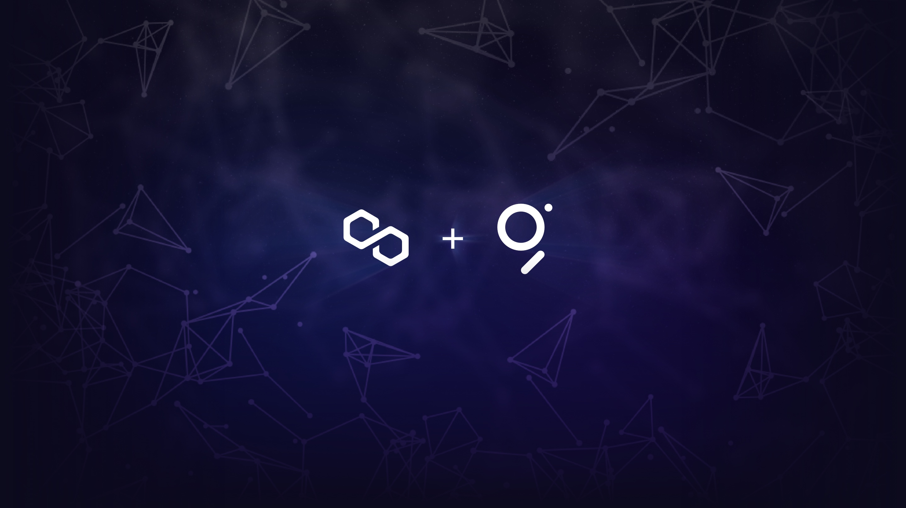
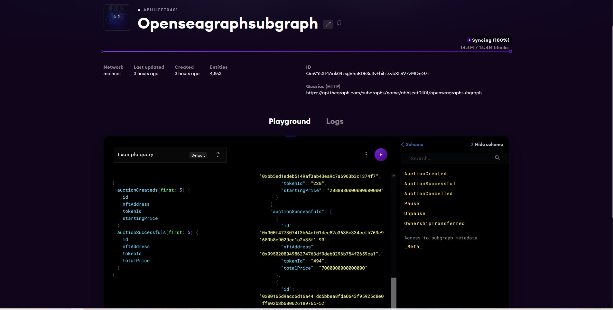

# Jab Opensea mets The Graph

## What is Jab Opensea mets The Graph
 We wanted to help creators artists designers who are on Opensea and want to identify their HOLDRs are. In other words if creators wanted to show their gratitude to user for acquiring their NFTs. There’s no easy way to do that without something like The Graph Indexing the contract and keeping track of who holds what.

This is the Opensea subgraph, currently deployed and being indexed on The Graphs Hosted Service [Jab Opensea mets The Graph](https://thegraph.com/hosted-service/subgraph/abhijeet0401/openseagraphsubgraph).

If you want to make changes to it or create your own subgraphs

Customization will mean editing the following files:
- subgraph.yaml
- schema.graphql
- src/mappings.ts

## Welcome to join in and feel free to contribute.